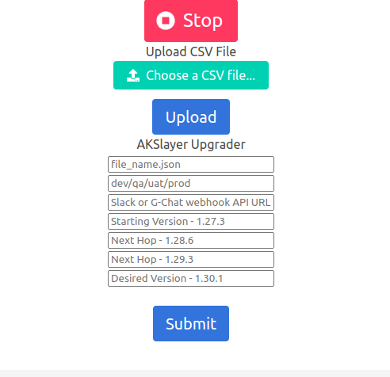
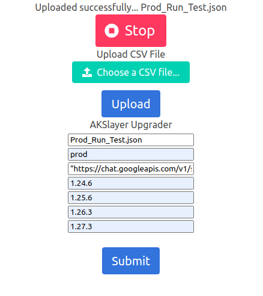
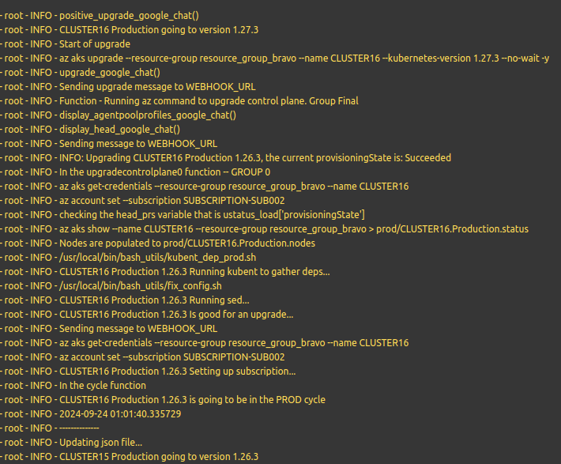
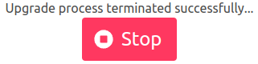
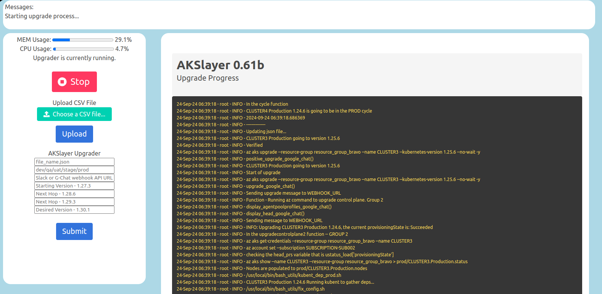

# (AK[S)layer]: Automate and Scale AKS Cluster Upgrades
An open-source, highly scalable, hands free SaaS tool for upgrading multiple AKS clusters and covering multiple version hops.


## AKSlayer0.61b Quickstart Guide :
1. `git clone https://github.com/multipathmaster/akslayer.git`
2. `docker build -t akslayer0.61b .`
3. `docker run -it -p 5000:5000 akslayer0.61b`
4. Follow the link in the terminal to go to your azure page and register the device. - This should be your admin account!!
5. Browse to http://localhost:5000



6. Upload your CSV file: an example has been provided below that was a 'save as csv' from google sheets.
7. Fill out the file_name.json field (a message will appear at the top with your json file name, copy this).  Don't worry, your CSV file has already been converted to json format.
8. Fill in `dev`, `qa`, `uat`, `stage` or `prod`.
9. Place your chat room's **"webhook_url"** surrounded by double quotes.  Surrounded By **Double Quotes**. **SURROUNDED BY DOUBLE QUOTES**.
10. Put in the lowest version of your AKS fleet (i.e. the lowest version number that one or more clusters share).
11. Put in the next hop for these lower versions.  This will also catch AKS clusters that are "starting" from this major version (minor version doesn't matter).
12. Put in the next hop after this.  This will catch any AKS clusters that are "starting" from this major version.
13. Put in your desired version you want all clusters to end up at and click 'Submit.'



14. Watch your chat room and the output while your clusters are upgrading.



15. Engage other team members to help you watch the output in the chats, spotting any issues or anomalies.


16. Once all of the upgrades have completed, click the stop button at the top of the page.



### Notes : 
1. If you are only going up one version: Use the 'Desired Version' and the previous 'Next Hop.'  But continue to fill in the 'Starting Version' and the first 'Next Hop.'  This creates uniformity as well as double checks that your original CSV file doesn't have a mistake in it.  If a cluster in the CSV file is marked '1.27.3' but in actuality it is at '1.26.X,' the upgrader will detect this, adjust the json file and proceed with the upgrade automatically.
### Thoughts : 
1. Be mindful of the networks that each AKS cluster exists within.  Ensure enough free IP's are available during the upgrade.
### Issues : 
1. So far the only issue that happens once in a while is a need to run the az aks reconcile command against a cluster.  The cluster is typically in a failed state and so the upgrade process skips this cluster until it's status becomes 'Succeeded.'
### Scaling Vertical : Consider the following: You have 25 clusters to schedule/upgrade.
The backend can handle a lot, but ideally 25 is a good cut off point.
### Scaling Wide : Consider the following: You have 50 clusters to schedule/upgrade.
1. `docker run -it -p 5000:5000 akslayer0.61b` --> first batch of 10 (1-10) (first tab `localhost:5000`)
2. `docker run -it -p 5001:5000 akslayer0.61b` --> second batch of 10 (11-20) (second tab `localhost:5001`)
3. `docker run -it -p 5002:5000 akslayer0.61b` --> third batch of 10 (21-30) (third tab `localhost:5002`)
4. `docker run -it -p 5003:5000 akslayer0.61b` --> fourth batch of 10 (31-40) (fourth tab `localhost:5003`)
5. `docker run -it -p 5004:5000 akslayer0.61b` --> fifth batch of 10 (41-50) (fifth tab `localhost:5004`)
6. Follow the link and register each instance using your azure admin account.
7. Make the decision if these go to different chat rooms.
8. Create different CSV files that contain 10 clusters per document, name them accordingly (first10.csv, second10.csv, etc...).
### Recommendations : 
1. Keep a nice XL or google sheet of the environment.  It takes no time at all to save it as a CSV file and to use this for the upgrade process.
2. If your organization allows use of your own admin account for these tasks, this is fine.  However think of creating an account soley for this purpose within Azure Active Directory(in a managed group).  This will make auditing easier down the road.
3. Have a solid game plan.  Prep your CSV files a few days before hand.  Double check that you have enough free IP's to do a cluster upgrade.  Ensure that items like twistlock or any other side car services are compatible with the version you are hopping to.  Test 4 or 5 clusters in the CSV file if you are uncomfortable with a big load at first.
4. Ideally you should start with Development and work your way up.
### Example CSV :
```
cluster_name,env,version,resource_group,location,subscription
CLUSTER1,Production,1.24.6,resource_group_alpha,Europe,SUBSCRIPTION-SUB001
CLUSTER2,Development,1.24.6,resource_group_charlie,United States,SUBSCRIPTION-SUB003
CLUSTER3,Stage,1.25.6,resource_group_bravo,Australia,SUBSCRIPTION-SUB002
CLUSTER4,QA,1.24.6,resource_group_bravo,Australia,SUBSCRIPTION-SUB002
CLUSTER5,UAT,1.27.3,resource_group_alpha,Europe,SUBSCRIPTION-SUB001
```
Although it should be of note that the only csv headers that the upgrader actually require are: `cluster_name,env,version,resource_group,subscription`.  This means that whatever sheet you are using could have more useful fields in it besides the upgrades (an environment sheet, CMDB snippet, etc...).  But pay attention to the headers themselves.  They are **case sensitive**.  Also take note of the **env** header and how the corresponding environments are labeled.  **p**roduction will get skipped and **P**roduction will get upgraded.  **qa** will get skipped and **QA** will get upgraded, etc...
### Recent Trials :
1. AKSlayer has upgraded **192** AKS Clusters in various environments and counting...
2. 81 at once, utilizing 5 containers, i.e. scaling wide.
### Running Headless :
1. Coming soon
### Ease of Use :
1. The modular design of AKSlayer allows it to be useful for Engineers, Operations staff, as well as DevOps Engineers.
2. It is built with flexibility in mind allowing one to run this from the convenience of their laptop/desktop/workstation.
3. The chat alerting mechanism means that all Staff members can simultaneously watch the upgrade process together.
4. Easier troubleshooting is achieved by marking failed or unsuccessful clusters as such and continuing forward, which means that a Staff member is now freed up to run reconcile or look at the size of the network to make any adjustments while the upgrade process continues with the rest of the clusters.
5. Bury the headache of doing a 2-3 day upgrade cycle with 6+ staff to done in just a few hours with 1-2 staff.

## End of Line

